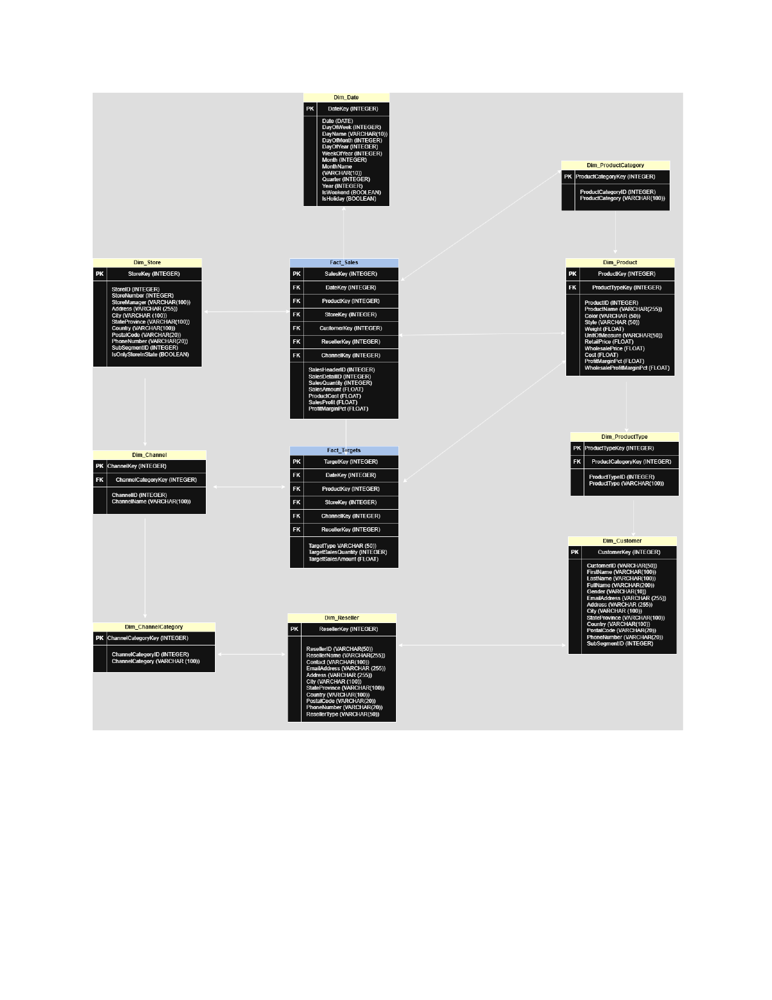
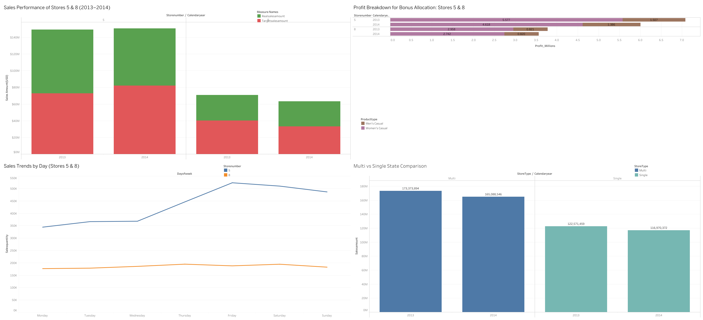

# Retail Data Warehouse & Sales Analytics

An end-to-end business intelligence system that turns raw retail sales data into
store-level decisions, built on **Snowflake** with an **ELT pipeline from Azure
Blob Storage**, a dimensional (star) schema, a SQL data-access layer, and an
interactive **Tableau** dashboard.

**[View the live dashboard on Tableau Public →](https://public.tableau.com/app/profile/avantika.sharma5537/viz/IMT577_DW_Avantika_Sharma_Dashboard_Story/Dashboard1)**

---

## The business problem

A retailer that manufactures and sells apparel through physical stores, an online
channel, and resellers wanted to understand the performance of two of its stores
(**Store 5 and Store 8**) and make concrete operational decisions:

- Are these stores hitting their sales targets, and will they meet plan for the year?
- Should either store be closed?
- How should a fixed annual **bonus pool** ($500K in 2013, $400K in 2014) be split between them, based on casualwear performance?
- Which **days of the week** drive demand, so staffing and promotions can be scheduled?
- Do **states with multiple stores** outperform single-store states (i.e., is clustering worth it)?

Answering these required more than a spreadsheet: sales, targets, products,
channels, and geography all had to be integrated into one queryable model.

---

## What I built

A four-layer BI system, each layer in its own SQL file:

| Layer | File | What it does |
|---|---|---|
| **1. Staging** | [`sql/01_staging.sql`](sql/01_staging.sql) | Raw source CSVs loaded from **Azure Blob Storage** into Snowflake staging tables, with no transformation (the "load" in ELT). |
| **2. Dimensions** | [`sql/02_dimensions.sql`](sql/02_dimensions.sql) | Cleaned, conformed dimension tables with surrogate keys, retained natural keys, and unknown members. |
| **3. Facts** | [`sql/03_facts.sql`](sql/03_facts.sql) | Three fact tables (actual sales + two target grains) with enforced referential integrity. |
| **4. Views** | [`sql/04_views.sql`](sql/04_views.sql) | A data-access layer (pass-through views) plus four analytical views, one per business question. |

**Stack:** Snowflake · Azure Blob Storage · SQL (ELT) · Tableau

### Architecture

```
Source CSVs ──> Azure Blob Storage ──> Snowflake staging
                                            │  (ELT: load first,
                                            ▼   transform in-warehouse)
                                     Dimensions + Facts (star schema)
                                            │
                                            ▼
                                     SQL views (access + analytics)
                                            │
                                            ▼
                                     Tableau dashboard
```



See [`docs/data_dictionary.md`](docs/data_dictionary.md) for table grain and design rationale.

---

## Design decisions worth calling out

- **ELT, not ETL.** Data lands raw in Snowflake first; all cleaning and conforming happens in SQL inside the warehouse. This keeps transformations version-controlled and re-runnable.
- **Separate fact tables for actuals vs. targets.** Actual sales are at transaction grain; targets arrive annually. Forcing them into one table would create a grain mismatch, so they're modeled separately and joined through shared dimensions.
- **Enforced referential integrity via unknown members.** Every dimension has a `-1` "unknown" row, and the fact loads use `COALESCE`/`CASE` so no fact row ever carries a NULL foreign key, a detail that keeps aggregate queries honest.
- **A data-access layer.** Pass-through views (explicit column lists, never `SELECT *`) insulate the warehouse from downstream tools, so schema changes don't break Tableau.
- **A conformed geography dimension** built by unioning customer, store, and reseller addresses, so location analysis is consistent across all three.

---

## Findings & recommendations

Working from the analytical views and dashboard:

- **Sales vs. target:** Store 5 consistently outpaced its target across both years and held demand steady into 2014. Store 8 beat target in 2013 but **fell short in 2014**, signaling a slowdown to watch rather than an immediate closure case.
- **Bonus allocation:** Store 5 drove roughly **$7M** of casualwear profit in 2013 vs. Store 8's smaller share, so the pool was split proportionally to profit contribution. **2013: ~$346K / $154K; 2014: ~$310K / $90K** (Store 5 / Store 8).
- **Weekly demand:** Store 5 spikes **Friday–Saturday** (weekend-driven traffic); Store 8 is flat across the week (steady everyday shoppers). Different demand shapes → different staffing and promotion calendars.
- **Store density:** States with **multiple stores generated $40M+ more in annual sales** than single-store states, suggesting clustering amplifies rather than dilutes reach in strong markets.



Full breakdown with screenshots in [`dashboard/`](dashboard/README.md).

---

## Repository structure

```
retail-data-warehouse/
├── README.md
├── sql/
│   ├── 01_staging.sql       # Azure Blob -> Snowflake staging (ELT load)
│   ├── 02_dimensions.sql    # dimensions: surrogate keys, unknown members
│   ├── 03_facts.sql         # three fact tables, enforced FK integrity
│   └── 04_views.sql         # access layer + analytical views
├── docs/
│   ├── dimensional_model.png
│   └── data_dictionary.md
└── dashboard/
    ├── README.md            # Tableau Public link + screenshots
    └── *.png
```

## Notes

Built with a provided retail dataset (source CSVs) as part of a structured BI
curriculum. The data modeling, ELT logic, SQL views, and dashboard are my own
work. The Azure Blob container and Snowflake environment used during development
are no longer live, so the SQL is provided to be read and reviewed; it targets
Snowflake SQL and can be run against any Snowflake instance after loading the
source files.
